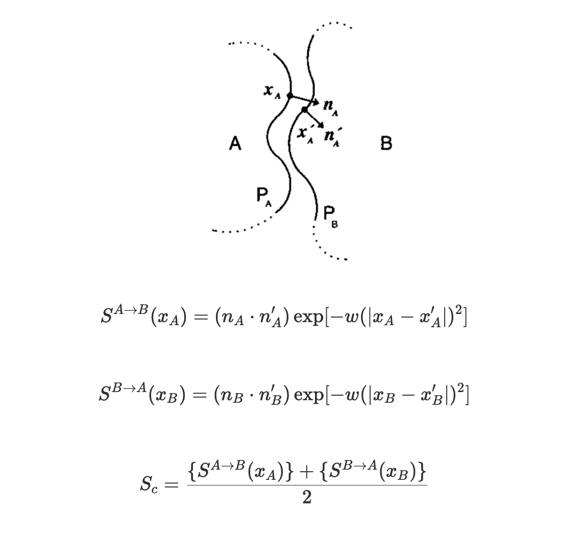

# scPDB: an easy shape complementarity score calculator
scPDB is an easy-to-use tool for calculating shape complementarity (Sc) scores, as first described by [Lawrence & Colman, 1993](https://www.sciencedirect.com/science/article/abs/pii/S0022283683716487). Sc scores quantify the geometric fit of two protein interfaces, irrespective of their chemical or amino acid compositions. scPDB is quick (processes a single PDB file in a few seconds) and runs on CPU (can run on your local device). 

## Installing scPDB
scPDB manages its dependencies using conda and requires a conda environment with only a few packages. scPDB can be installed using the following commands:
```
git clone https://github.com/shilov25/scPDB
cd scPDB
conda env create -f requirements.yaml
conda activate sc_pdb
```
## Running scPDB
### Single file processing
In order to calculate the Sc score for a single `.pdb` file, scPDB requires the file path and the chains that differentiate the two interaction interfaces (these are termed "Binder 1" and "Binder 2" in the program).

These flags are *required* for single file processing:
 * `--pdb_file` Path to PDB file.
 * `--chains` Chains for which to calculate shape complementary score.

These flags are *recommended* for single file processing:
 * `--output_dir` Path to output directory **(default="./")**.
 * `--save_obj_files` If provided, saves PyMOL interface mesh outputs as individual `.obj` files, helpful for inspection and troubleshooting. If Sc scores are unexpected, issues may stem from incorrect mesh generation.
 * `--save_binder_files` If provided, saves Binder 1 and Binder 2 as individual `.pdb` files.

### Single file example
To calculate the Sc score between an antibody and an antigen, use `--chains HL_Y` which treats the heavy and light chains as a single interface, and the antigen chain as a separate interface. Chains may also be omitted from this flag `-chains H_Y` so that only the heavy chain comprises the antibody interface.
```
python run_scPDB.py --pdb_file ./examples/1FDL.pdb --chains HL_Y --output_dir ./examples
```
scPDB will generate a `1FDL_sc_histogram.svg` to visualize the distribution of Sc scores for each binder, as well as a `1FDL_sc_scores.csv` file containing the individual scores for chains HL and Y, interface areas for HL and Y, and the final Sc score.

### Batch file processing
In order to calculate the Sc scores for a batch of `.pdb` files, scPDB requires a `.csv` file containing the file paths (`pdb_file`) and chain information (`chains`), as formatted for single file processing. See `examples.csv`. Batch processing will generate the same `sc_histogram.svg` and `sc_scores.csv` outputs for each individual `.pdb` file, as well as a combined `.csv` containing all the Sc scores for the batch. See `examples_sc_scores.csv`.

These flags are *required* for batch processing:
 * `--batch_csv` Path to PDB file.

These flags are *recommended* for batch processing:
 * `--output_dir` Path to output directory **(default="./")**.

### Batch example
Before running a batch command, ensure that the single file processing command executes succesfully.
```
python run_scPDB.py --batch_csv ./examples/examples.csv --output_dir ./examples
```
### Optional scPDB argument flags
These flags may be specified, but it is **recommended** to keep them at their default values.

 * `--run_name` Naming convention for output files. If not provided, uses PDB filename **(default = None)**.
 * `--w_constant` Non-zero scalar constant for defining rate of sc score decay **(default = 0.5)**.
 * `--surface_point_density` Number of points/&Aring;<sup>2</sup> to sample **(default = 30)**. Values >30 do not significantly change Sc scores.
 * `--interface_thresh` Distance threshold (&Aring;) for defining interaction interface between two binders **(default = 1.5)**. The Sc score is extremely sensitive to this value since it determines the size of the interface meshes to sample from. Values >3 not recommended.

## Defining surface complementarity
Although shape complementarity scores range anywhere from [-1, 1], most protein interactions falling somewhere between 0 and 1, with 0 indicating poor shape complementarity and 1 indicating perfect shape complementarity. Sc scores depend on two components: surface orientation and surface distance. The shape complementarity is described as follows:
<div align='center'>

<div align='left'>

**Orientation component:** Two surfaces (P<sub>A</sub> and P<sub>B</sub>) that are oriented away from one another will have a normal vector dot product (n<sub>A</sub> &middot; n'<sub>A</sub>) that is negative or close to 0. Surfaces that are highly oriented will produce a positive normal vector dot product.

**Distance component:** Two surfaces that are further apart are less complementary, since the fit between the two proteins is less "snug". Consider the following: if P<sub>A</sub> and P<sub>B</sub> are being pulled apart, the absolute value of the distance between x<sub>A</sub> and x'<sub>A</sub> is growing quadratically, resulting in a large negative value. As a result, Sc approaches 0 (e<sup>-&infin;</sup> = 0). Inversely, if the two surfaces are very close, the absolute value of the distance approaches 0 and Sc approaches 1 (e<sup>0</sup> = 1). -&#119908; is a scalar weight constant, as defined by Lawrence & Colman, 1993.
## Comparison to original Lawrence & Colman reported values